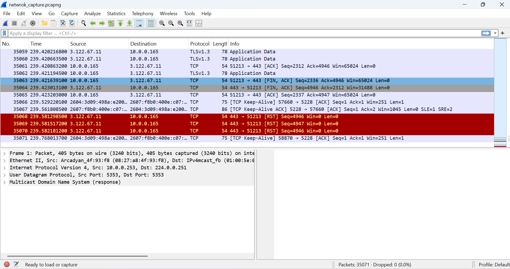

# Network Traffic Capture using Wireshark

## Objective
To capture and analyze network traffic using Wireshark.

## Tools Used
- Wireshark
- Npcap

## Steps Performed
1. Installed Wireshark and Npcap
2. Selected Wi-Fi interface for capture
3. Started packet capture
4. Visited websites such as Google to generate traffic
5. Stopped capture after a few minutes
6. Saved capture file as network_capture.pcapng

## Observations
- Captured protocols include TCP, UDP, and TLSv1.3
- TLSv1.3 shows that the communication is encrypted (HTTPS)
- Observed communication between local IP (private) and external servers (public)
## Screenshot Evidence

## Capture File
[Download network capture](network_capture.pcapng)
## Conclusion
Wireshark successfully captured network traffic and demonstrated how data is transmitted securely over the internet.
